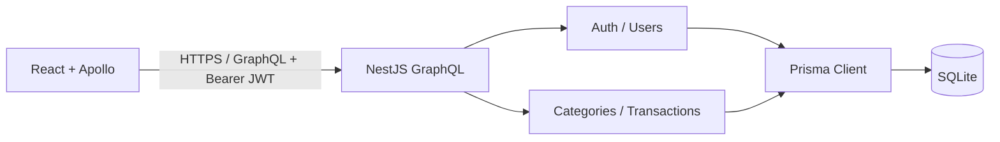
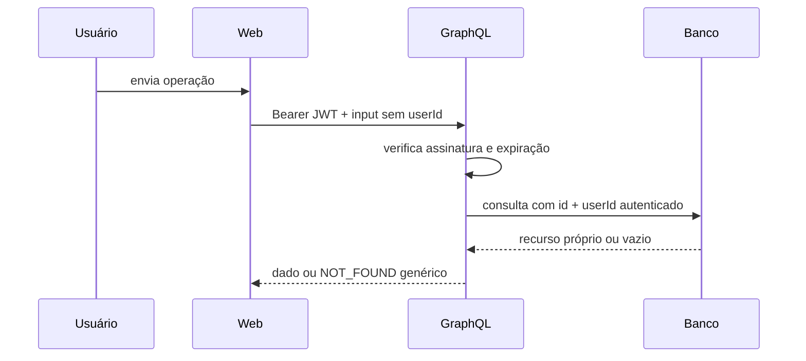

# Arquitetura

## Decisão

Monorepo `pnpm` com duas aplicações independentes e um monólito modular no backend. A estrutura mantém baixo custo operacional para o desafio sem misturar fronteiras de autenticação, categorias e transações.

## Fronteiras

- `frontend/`: apresentação, navegação, estado remoto, formulários e sessão no navegador.
- `backend/`: contrato GraphQL, autenticação/autorização, regras e persistência.
- `docs/`: fonte de verdade do produto, arquitetura e operação.
- `specs/`: unidades pequenas, verificáveis e aprováveis de trabalho.
- `.claude/`: regras, agentes especializados e skills locais para Claude Code.

## Backend por feature

Cada módulo futuro contém resolver, service, DTOs/inputs, models GraphQL e testes. Resolvers traduzem GraphQL; services aplicam regras e filtros de propriedade; Prisma é a única camada de persistência. Não há repositório genérico antes de uma necessidade concreta.

## Frontend por feature

`src/app` concentra providers e rotas; `src/features/{auth,categories,transactions,dashboard}` concentra operações, componentes e testes; `src/components` contém primitives reutilizáveis; `src/lib` contém Apollo, sessão e utilitários. O cliente nunca aplica autorização como controle de segurança — apenas como UX.

## Fluxo protegido

## Dependências permitidas

- Feature pode depender de infraestrutura compartilhada e do módulo de usuário autenticado.
- Transação pode consultar categoria para validar propriedade.
- Categoria não depende de transação em código; a restrição de exclusão pode consultar o Prisma de forma explícita.
- Banco e tipos gerados não importam resolvers nem UI.

## Qualidades

- Segurança: filtros de propriedade obrigatórios e testes de IDOR.
- Consistência: dinheiro inteiro, validação em bordas e erros tipados.
- Operação: configuração validada, health query, logs sem dados sensíveis.
- Evolução: uma SPEC por mudança; ADR para decisão irreversível ou transversal.
