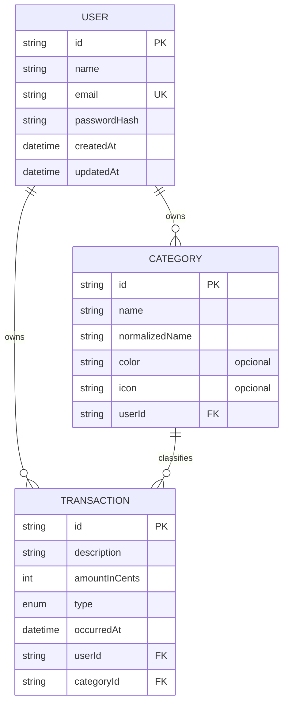

# Modelo de dados

## Invariantes

- IDs são CUIDs opacos.
- `User.email` é único globalmente. O índice único do SQLite é sensível a caixa, então a unicidade só vale porque um `CHECK` impede gravar forma não normalizada — `'Pessoa@X'` e `' pessoa@x '` são recusados no banco, não apenas na borda. Ver ADR-0007.
- `Category(userId, normalizedName)` é único.
- `Category.color` e `Category.icon` são opcionais; quando informados, valem as restrições de `BR-CAT-004`.
- `Transaction.amountInCents` é inteiro positivo; o tipo define sinal sem persistir valores negativos. A afinidade de tipo do SQLite aceitaria um decimal em coluna `INTEGER`, por isso a migration adiciona um `CHECK` de positividade e integralidade que o Prisma não consegue declarar no schema, sob as obrigações do ADR-0007. Rejeitar entrada decimal continua sendo dever da borda, conforme ADR-0006: o Prisma Client **trunca** um decimal antes do SQL, de modo que um cliente que enviasse reais em vez de centavos gravaria `10` no lugar de `1005` sem erro. Fechar essa borda com `@IsInt()` é pré-condição do `AC-001` da SPEC-008.
- `Transaction.userId` e `Category.userId` devem coincidir. `Category` expõe `@@unique([id, userId])` e `Transaction` referencia o par por chave estrangeira composta, de modo que o banco recusa uma transação apontando para a categoria de outra pessoa (`BR-TXN-003`). A validação de service permanece, para devolver erro de domínio em vez de violação de FK.
- Exclusão de usuário propaga para seus dados; exclusão de categoria é restrita enquanto houver transações.

## SQLite

`DATABASE_URL="file:./prisma/dev.db"` no desenvolvimento. O arquivo do banco, journals e dados reais nunca entram no Git. Migrações são versionadas; `db push` não substitui migrations na entrega.

## Datas

Persistir UTC e transportar ISO 8601. A interface formata com locale `pt-BR`; não converter uma data de ocorrência para “agora” em caso de erro.
