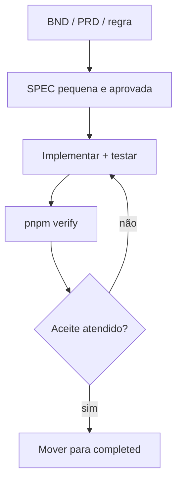

# Claude Code e harness engineering

## Objetivo do harness

O harness reduz decisões implícitas: o agente recebe contexto versionado, trabalha em uma SPEC pequena, executa gates locais e entrega evidência revisável. `CLAUDE.md` é a porta de entrada; `AGENTS.md` permite compatibilidade com outros agentes.

## Configuração

1. Instale Claude Code conforme a documentação oficial e autentique-se.
2. Abra a raiz do repositório; nunca inicie dentro de `frontend/` ou `backend/`.
3. Instale e conecte os MCPs descritos em `MCP_SETUP.md`.
4. Execute `pnpm setup` e `pnpm verify` antes da primeira mudança.
5. Peça ao agente para ler `CLAUDE.md`, a SPEC ativa e apenas as referências citadas por ela.

## Ciclo recomendado



## Prompt de início

```text
Leia CLAUDE.md e specs/active/SPEC-XXX.md. Faça primeiro uma inspeção somente leitura.
Implemente exclusivamente o escopo da SPEC, preservando as regras citadas.
Execute os comandos de verificação e entregue um resumo por critério de aceite.
Pare e registre uma pergunta se uma decisão de produto não estiver documentada.
```

## Disciplina de contexto

- Uma sessão por SPEC quando possível.
- Referencie arquivos, não cole documentos longos no prompt.
- Não permita “resolver depois”: pendências recebem ID `OPEN-*` e dono.
- Mantenha diffs pequenos; revisão deve relacionar código a critérios de aceite.
- O agente não publica, envia ou remove dados sem autorização explícita.

## Agentes locais

`scout` inspeciona sem editar; `planner` quebra a SPEC; `code-reviewer` procura regressões; `qa` valida critérios. Eles são papéis, não substitutos da revisão humana.

## Hooks e permissões

Este starter não fixa `.claude/settings.json` porque schemas de hooks e permissões mudam com o Claude Code e o guia recomenda validar a sintaxe contra a versão instalada. Depois da primeira instalação, adicione em PR separado:

- negação de leitura de `.env`, bancos e diretórios de credenciais;
- confirmação humana para publicação, push, migration destrutiva e remoção;
- hook pós-edição rápido para formatação/lint focado;
- hook de encerramento para `scripts/validate.sh` quando o custo for aceitável.

Instrução em prompt não é bloqueio. Ações críticas devem ser controladas por permissões/hooks testados ou por CI/proteção da branch.
